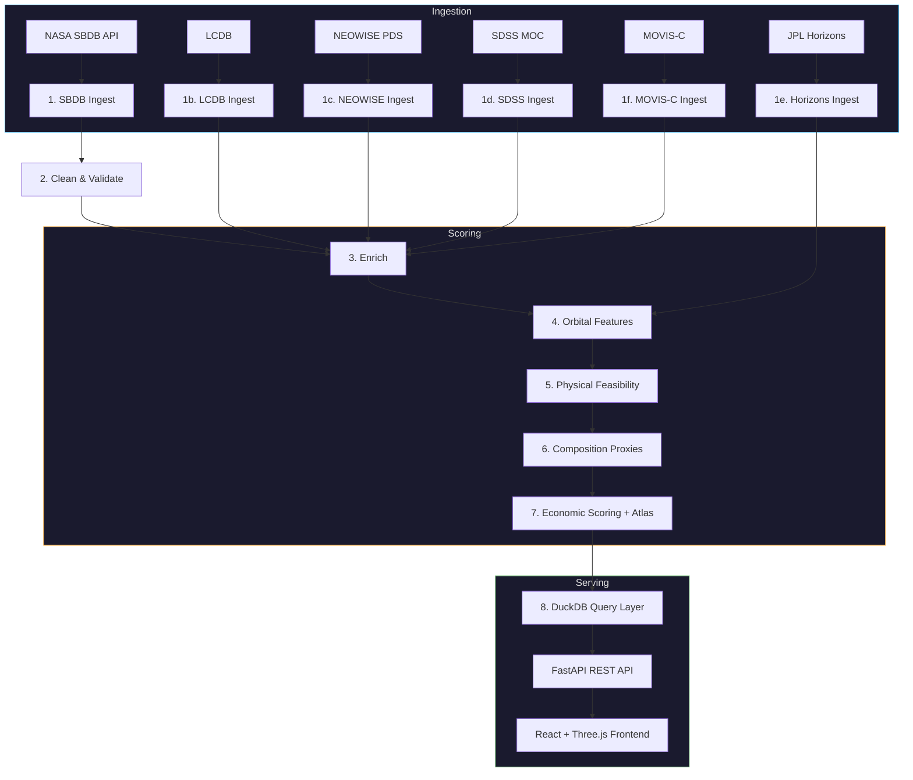
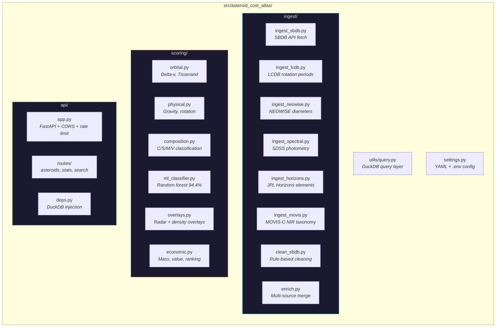

# asteroid-cost-atlas

   

A reproducible data-engineering pipeline that transforms raw NASA small-body catalogs into an economic accessibility atlas for space-resource missions. Combines orbital mechanics proxies, physical asteroid properties, and mission-cost estimation features to rank candidate asteroid mining targets.

### Key numbers

| Metric | Value |
|---|---|
| Asteroids scored | **1,521,843** across 107 columns |
| Data sources | 6 (SBDB, LCDB, NEOWISE, SDSS MOC, MOVIS-C, JPL Horizons) |
| Positive per-kg margin | **10,336** asteroids |
| Economically viable | **609** targets (enough material for at least one profitable mission) |
| Total profitable missions | **24,142** supported across all viable targets |
| Top campaign profit | **$376M** |

---

## Motivation

Thousands of asteroids are cataloged. Very few have been evaluated systematically for economic or mission feasibility. Most accessibility analyses are buried in academic papers, require specialized orbital mechanics tools, or are not reproducible.

`asteroid-cost-atlas` fills that gap: a structured, open pipeline that takes raw SBDB data and produces a ranked, feature-rich dataset answering the question — *which asteroids are cheapest to reach, easiest to mine, and most economically promising?*

Inspired by the accessibility and value estimates pioneered by [Asterank](https://www.asterank.com), this project focuses on a similar but slightly improved goal: building a transparent, reproducible pipeline that evaluates asteroid mission accessibility across the full NASA catalog (~1.5 million objects) using orbital mechanics proxies such as inclination penalties, Tisserand stability, and rotation/regolith feasibility signals. Rather than producing a single heuristic profitability score, it constructs a research-grade dataset from primary sources like the [SBDB Query API](https://ssd-api.jpl.nasa.gov/doc/sbdb_query.html) and the [LCDB](https://minplanobs.org/mpinfo/php/lcdb.php), with integrations from [NEOWISE](https://sbn.psi.edu/pds/resource/neowisediam.html), [JPL Horizons](https://ssd.jpl.nasa.gov/horizons/), [SDSS MOC](https://faculty.washington.edu/ivezic/sdssmoc.html), and [MOVIS-C](https://cdsarc.cds.unistra.fr/viz-bin/cat/J/A+A/617/A12), enabling systematic comparison, extension with new surveys, and engineering-oriented target screening at scale.

---

## Pipeline Architecture



---

## Repository Structure



| Directory | Purpose |
|---|---|
| `tests/` | 18 test modules + conftest (85% coverage gate) |
| `web/` | React frontend — Vite + TypeScript + Three.js |
| `notebooks/` | `explore_atlas.ipynb` — interactive data explorer |
| `configs/` | `config.yaml` — SBDB fields, page size, output paths |
| `data/raw/` | Cached API responses + per-run metadata JSON |
| `data/processed/` | Pipeline output Parquets (date-stamped) |
| `docs/` | `CICD.md`, `DATA_DICTIONARY.md`, `METHODOLOGY.md` |
| `scripts/` | `audit.py` (pipeline audit), `ship.sh` (CI/CD workflow) |
| `.github/workflows/` | `ci.yml` — CI: lint + typecheck + test; CD: Docker → ECR → ECS |
| Root files | `Dockerfile`, `start.sh`, `Makefile`, `pyproject.toml`, `.env.example` |

---

## Quickstart

```bash
git clone https://github.com/Ron-Zehavi/asteroid-cost-atlas.git
cd asteroid-cost-atlas
python -m venv .venv && source .venv/bin/activate
pip install -e ".[dev,web]"
cp .env.example .env
./start.sh                    # launches API :8000 + frontend :5173
```

To run the full pipeline from scratch (fetches ~1.5M asteroids, takes a few minutes):

```bash
make pipeline                 # ingest → clean → enrich → score → atlas
```

---

## Setup

Requires **Python 3.11+**.

```bash
# Create and activate a virtual environment
python -m venv .venv && source .venv/bin/activate

# Install package with dev dependencies
pip install -e ".[dev]"

# Copy environment config
cp .env.example .env
```

---

## Configuration

Runtime configuration is split across two files:

**`configs/config.yaml`** — static pipeline parameters:

```yaml
base_url: https://ssd-api.jpl.nasa.gov/sbdb_query.api

sbdb_fields:
  - spkid
  - full_name
  - a           # semi-major axis (AU)
  - e           # eccentricity
  - i           # inclination (deg)
  - om          # longitude of ascending node (deg)
  - w           # argument of perihelion (deg)
  - ma          # mean anomaly (deg)
  - epoch       # epoch of osculating elements (MJD)
  - H           # absolute magnitude — proxy for diameter
  - G           # magnitude slope parameter
  - diameter    # measured diameter (km), sparse
  - rot_per     # rotation period (hours), sparse
  - albedo      # geometric albedo, sparse
  - neo         # near-Earth object flag (Y/N)
  - pha         # potentially hazardous asteroid flag (Y/N)
  - class       # orbit classification (APO, ATE, AMO, etc.)
  - moid        # Earth minimum orbit intersection distance (AU)
  - spec_B      # SMASSII spectral taxonomy, sparse

page_size: 20000

paths:
  raw_json:     data/raw/sbdb.json
  csv_dir:      data/raw
  cache_dir:    data/raw/cache
  metadata_dir: data/raw/metadata
```

**`.env`** — environment overrides (never committed):

```bash
SBDB_PAGE_SIZE=20000   # reduce to fetch a smaller sample (e.g. 1000 for local testing)
```

All paths are resolved relative to the repository root regardless of working directory. Config is validated at startup via Pydantic — invalid fields raise immediately.

---

## Usage

```bash
# Launch the web application (backend + frontend, opens browser)
./start.sh        # starts API on :8000 and React dev server on :5173

# Run the full pipeline end-to-end
make pipeline     # ingest → enrich → score → atlas (all sources incl. MOVIS-C)

# Or run stages individually
make ingest            # fetch raw SBDB catalog (~1.5M objects)
make ingest-lcdb       # fetch LCDB rotation periods (~31K records)
make ingest-neowise    # fetch NEOWISE diameters/albedos (~164K objects)
make ingest-spectral   # fetch SDSS MOC photometry (~40K objects)
make clean-data        # validate and filter → clean Parquet
make enrich            # LCDB + NEOWISE + SDSS merge, H→diameter estimation
make ingest-horizons   # fetch JPL Horizons elements for NEAs (~35K objects)
make ingest-movis      # fetch MOVIS-C near-IR colors/taxonomy (~18K objects)
make score-orbital     # add orbital features (Horizons-enhanced) → scored Parquet
make score-physical    # add physical feasibility → scored Parquet
make score-composition # classify C/S/M/V from taxonomy + SDSS colors + albedo
make atlas             # economic scoring + final ranked atlas
make query             # run a sample query against the atlas
make audit             # run pipeline audit (column counts, coverage stats)

# Run audit with baseline comparison
python scripts/audit.py --save          # save current audit as baseline
python scripts/audit.py --compare       # compare against saved baseline

# CLI entry points (after pip install -e .)
asteroid-ingest --page-size 5000 --output data/raw

# Run tests
make test

# Lint and type-check
make lint
make typecheck
```

> **Note:** A full SBDB ingest fetches ~1.5 million records across ~75 paginated requests. On a typical connection this takes a few minutes. Subsequent runs skip all network requests — pages are cached to `data/raw/cache/` by content hash. LCDB download is ~40 MB, NEOWISE ~20 MB, SDSS MOC ~50 MB. Horizons is the slowest step — fetching ~35K NEAs at 2 req/s takes several hours; results are cached in `data/raw/horizons_*.parquet`.

Available `make` targets:

```
  install            Install package and dev dependencies (requires Python 3.11+)
  pipeline           Run full pipeline end-to-end
  ingest             Fetch raw SBDB catalog
  ingest-lcdb        Fetch LCDB rotation periods
  ingest-neowise     Fetch NEOWISE diameters/albedos
  ingest-spectral    Fetch SDSS MOC photometry
  ingest-horizons    Fetch JPL Horizons elements for NEAs
  ingest-movis       Fetch MOVIS-C near-IR colors and taxonomy
  clean-data         Validate and filter raw CSV
  enrich             LCDB + NEOWISE + SDSS + MOVIS merge, H→diameter estimation
  score-orbital      Apply orbital scoring (Horizons-enhanced)
  score-physical     Apply physical feasibility scoring
  score-composition  Classify composition from taxonomy + SDSS + albedo
  atlas              Economic scoring + final ranked atlas
  query              Run a sample query against the atlas
  audit              Run pipeline audit (column counts, coverage, baselines)
  data-info          Show available pipeline outputs and metadata
  clean-outputs      Remove processed Parquet outputs (keeps raw data)
  lint               Lint with ruff
  format             Format with ruff
  typecheck          Type-check with mypy
  test               Run tests with coverage
  serve              Start FastAPI backend (uvicorn on :8000)
  web-dev            Start React frontend dev server (Vite on :5173)
  web-build          Production build of the React frontend
  ship               Run all checks, push branch, and open PR to main
  docker             Build Docker image (single-container deployment)
  clean              Remove build artifacts and caches
```

---

## Example Query

The atlas is a standard Parquet file queryable with DuckDB, pandas, or any Arrow-compatible tool:

```sql
-- Top 5 viable mining targets by economic rank
SELECT name, composition_class AS class, delta_v_km_s AS dv_km_s,
       diameter_estimated_km AS diam_km, is_viable, economic_priority_rank AS rank
FROM 'data/processed/atlas_*.parquet'
WHERE is_viable = true
ORDER BY economic_priority_rank
LIMIT 5;
```

```
                 name class  dv_km_s  diam_km  is_viable      rank
     66146 (1998 TU3)     S 3.995776    2.864       True   52627.0
  1685 Toro (1948 OA)     S 5.408948    3.400       True   56321.0
      17182 (1999 VU)     S 5.421101    2.885       True   81411.0
   363505 (2003 UC20)     S 3.455269    1.876       True  105544.0
    175706 (1996 FG3)     C 1.153070    1.196       True  107988.0
```

Or use the built-in Python query layer:

```python
from asteroid_cost_atlas.utils.query import CostAtlasDB

db = CostAtlasDB("data/processed/atlas_20260404.parquet")
print(db.top_accessible(n=10))
print(db.nea_candidates())
print(db.stats())
db.close()
```

---

## Current Features

**Ingestion** ✓
- Full SBDB catalog fetch via paginated API requests (~1.5M objects, 19 fields)
- LCDB integration — 31K+ rotation periods with quality filtering (U >= 2-)
- NEOWISE integration — ~164K measured diameters and geometric albedos from thermal infrared
- SDSS MOC integration — ~40K photometric color indices for composition inference
- JPL Horizons integration — high-precision orbital elements for NEAs (~35K objects)
- MOVIS-C integration — ~18K near-IR color indices (Y-J, J-Ks, H-Ks) and probabilistic taxonomy from VizieR (Popescu et al. 2018)
- Page-level MD5-keyed disk cache — SBDB reruns skip network entirely
- Per-run metadata output (timestamp, source URL, fields, record count)
- Structured JSON logging with retry adapter for API resilience

**Data cleaning** ✓
- Sequential rule-based filter: non-finite elements, a <= 0, e >= 1
- Per-rule removal counts logged to metadata JSON
- Raw data never modified — all filtering is explicit and auditable

**Data enrichment** ✓
- Five-layer merge: LCDB → NEOWISE → SDSS → MOVIS → H→diameter estimation
- NEOWISE merge: fills diameter gaps (9% → ~20% directly measured), fills albedo gaps (9% → ~20%)
- SDSS merge: adds g-r, r-i color indices for composition inference downstream
- MOVIS merge: adds near-IR Y-J, J-Ks, H-Ks color indices for Bayesian composition model (particularly M-type identification)
- H→diameter estimation via IAU formula (D = 1329/sqrt(pV) x 10^(-H/5))
- Taxonomy-aware albedo priors: measured albedo → NEOWISE → class prior (C: 0.06, S: 0.25, M: 0.14, V: 0.35) → default 0.154
- LCDB merge: taxonomy, albedo gap-fill, rotation provenance tracking
- Provenance columns: `diameter_source` ("measured"/"neowise"/"estimated"), `rotation_source` ("sbdb"/"lcdb")

**Orbital scoring** ✓
- Delta-v proxy (km/s) — Hohmann transfer + inclination correction (Shoemaker-Helin)
- Tisserand parameter w.r.t. Jupiter — orbit stability and accessibility classification
- Inclination penalty — normalised plane-change cost in [0, 1]
- JPL Horizons preference — NEAs use higher-fidelity perturbed elements when available
- `orbital_precision_source` column tracks "horizons" vs "sbdb" element provenance
- Fully vectorised over the 1.5M-row catalog with strict input validation

**Physical feasibility scoring** ✓
- Surface gravity estimate (m/s²) — spherical model with assumed density (99.9% coverage)
- Rotation feasibility [0, 1] — piecewise model penalising spin-barrier (<2h) and thermal cycling (>100h)
- Regolith likelihood [0, 1] — combined size and rotation signal
- Each feature scored independently (gravity doesn't require rotation data)
- NEOWISE-measured diameters improve gravity estimates for ~164K objects

**Composition proxies with meteorite-analog resource model** ✓
- Probabilistic Bayesian composition model with class probability vectors (prob_C/S/M/V), confidence scores, and P10/P50/P90 PGM ranges
- ML classifier (random forest trained on 29,697 spectroscopically confirmed asteroids, 94.4% accuracy) adds ml_prob_C/S/M/V and ml_confidence columns. Requires optional `[ml]` dependency (scikit-learn)
- High-confidence overlays: curated radar albedo (Shepard et al. 2010, 2015) and measured density (Carry 2012) for ~20 well-studied asteroids, adjusting prob_* columns for confirmed metallic/carbonaceous targets
- Six-layer classification: taxonomy → spectral type → SDSS colors → MOVIS NIR → albedo → "U"
- MOVIS NIR colors as additional Bayesian likelihood term (particularly valuable for M-type identification)
- SDSS color-index inference: empirical g-r/r-i boundaries classify C/S/V types
- Multi-resource value model based on Cannon et al. (2023) and Lodders et al. (2025):
  - **Water** — C-type: 15 wt%, extraction yield 60%, $500/kg in-space propellant value
  - **Bulk metals** — Fe/Ni/Co: M-type 98.6 wt%, $50/kg in-orbit construction value
  - **Precious metals** — PGMs+Au: M-type 42 ppm (Cannon 2023 50th %ile), $35,000/kg spot
- Per-class total value: C=$50/kg (water-dominated), M=$25/kg (metals), S=$7/kg, V=$4/kg

**Economic scoring with mission-architecture cost model** ✓ *(backend data — not yet exposed in UI, prep for Mission Planner)*
- Mass estimation from diameter + composition-specific density (C: 1,300, S: 2,700, M: 5,300 kg/m³)
- Specimen-return model: selectively extract precious metals (Pt, Pd, Rh, Ir, Os, Ru, Au)
- Subsystem-based mission cost: $300M minimum (spacecraft + payload + ops) + transport + extraction
- Per-asteroid break-even analysis: minimum extraction to cover $300M fixed cost
- **10,336 asteroids** with positive per-kg margin; **609 viable** (enough extractable material)
- Every mission and campaign individually profitable by construction
- Per-metal break-even: kg of each specific metal needed to justify mission
- `economic_priority_rank` — strict ordering with deterministic tie-breaking (used as default table sort)
- `is_viable` — viability flag (used for row highlighting and filtering in UI)
- Final atlas: 1,521,843 asteroids scored across 107 columns

**DuckDB query layer** ✓
- Zero-server SQL over Parquet via stable `atlas` view
- Pre-built queries: `top_accessible`, `nea_candidates`, `stats`, `delta_v_histogram`
- Context manager support (`with CostAtlasDB(path) as db:`)
- Input validation on all query parameters
- Returns DataFrames — ready for web API serialisation or notebook display

**Web application** ✓
- FastAPI REST API wrapping the CostAtlasDB query layer (`src/asteroid_cost_atlas/api/`)
- Endpoints: `/api/stats`, `/api/asteroids` (paginated, filterable), `/api/asteroids/{spkid}`, `/api/asteroids/top`, `/api/asteroids/nea`, `/api/search?q=`, `/api/charts/delta-v`, `/api/charts/composition`, `/api/health`
- React frontend (`web/`) with Vite + TypeScript
- AsteroidTable with collapsible metals breakdown (7 base columns + expandable 7 precious metal columns), viable row highlighting, sortable by name/confidence/diameter/delta-v
- FilterBar (composition class, NEO, viability, max delta-v default 3 km/s), SearchBox, StatsCards (total/scored/NEA/min/median delta-v)
- 3D solar system scene (react-three-fiber / Three.js): Sun + 8 planets with Kepler propagation, asteroid point clouds color-coded by composition/delta-v/viability/confidence, orbit line highlight on selection, camera focus on click
- Orbit zone shading: NEO Region, Main Belt, Jupiter Trojans bands
- Transfer trajectory simulation: Hohmann transfer arcs with 4 mission phases (waiting, window_open, in_transit, arrived) and animated spacecraft model
- About modal with project vision, methodology, and references
- TimelineSlider for epoch propagation with playback controls (pause, 10 d/s, 100 d/s)
- 17 API tests, 18 test modules, 30 source files

**Config system** ✓
- YAML-defined fields with Pydantic validation (`extra="forbid"`)
- `.env` overrides for environment-specific parameters
- All paths resolved to absolute at load time

---

## Dataset Outputs

The atlas dataset (`data/processed/`) contains one row per asteroid in Parquet format.

**Ingested columns** (available after `make ingest`):

| Column | Source | Description |
|---|---|---|
| `spkid` | SBDB | JPL SPK-ID — `20000001` = (1) Ceres |
| `name` | SBDB | Full designation |
| `a_au` | SBDB | Semi-major axis (AU) |
| `eccentricity` | SBDB | Orbital eccentricity |
| `inclination_deg` | SBDB | Orbital inclination (degrees) |
| `long_asc_node_deg` | SBDB | Longitude of ascending node (degrees) |
| `arg_perihelion_deg` | SBDB | Argument of perihelion (degrees) |
| `mean_anomaly_deg` | SBDB | Mean anomaly (degrees) |
| `epoch_mjd` | SBDB | Epoch of osculating elements (Modified Julian Date) |
| `abs_magnitude` | SBDB | Absolute magnitude H (99.8% coverage) |
| `magnitude_slope` | SBDB | Magnitude slope parameter G (sparse) |
| `diameter_km` | SBDB | Measured diameter (km) — 9.2% coverage |
| `rotation_hours` | SBDB | Rotation period (hours) — 2.3% coverage |
| `albedo` | SBDB | Geometric albedo — 9.1% coverage |
| `neo` | SBDB | Near-Earth Object flag (Y/N) |
| `pha` | SBDB | Potentially Hazardous Asteroid flag (Y/N) |
| `orbit_class` | SBDB | Orbit classification (APO, ATE, AMO, MBA, etc.) |
| `moid_au` | SBDB | Earth minimum orbit intersection distance (AU) |
| `spectral_type` | SBDB | SMASSII spectral taxonomy (sparse) |

**Enrichment columns** (added by `make enrich`):

| Column | Description |
|---|---|
| `diameter_estimated_km` | Measured diameter (pass-through) or H-derived estimate — 99.9% coverage |
| `diameter_source` | Provenance: "measured", "neowise", or "estimated" |
| `rotation_source` | Provenance: "sbdb" or "lcdb" |
| `taxonomy` | LCDB taxonomic class (C, S, V, B, M, etc.) — 2% coverage |
| `movis_yj` | MOVIS-C Y-J near-IR color index (sparse — ~18K objects) |
| `movis_jks` | MOVIS-C J-Ks near-IR color index (sparse — ~18K objects) |
| `movis_hks` | MOVIS-C H-Ks near-IR color index (sparse — ~18K objects) |
| `movis_taxonomy` | MOVIS-C probabilistic taxonomic classification (sparse — ~18K objects) |

**Orbital scoring** (added by `make score-orbital`):

| Column | Description |
|---|---|
| `delta_v_km_s` | Simplified mission delta-v proxy (km/s) — Hohmann + inclination correction |
| `tisserand_jupiter` | Tisserand parameter w.r.t. Jupiter — T_J > 3 main belt, 2–3 accessible NEAs |
| `inclination_penalty` | Normalised plane-change cost in [0, 1] via sin²(i/2) |
| `orbital_precision_source` | Element provenance: "horizons" (NEAs) or "sbdb" (all others) |

**Physical feasibility scoring** (added by `make score-physical`):

| Column | Description |
|---|---|
| `surface_gravity_m_s2` | Estimated surface gravity (m/s²) — 99.9% coverage |
| `rotation_feasibility` | Operational spin-rate score [0, 1] — 2.3% coverage |
| `regolith_likelihood` | Regolith presence score [0, 1] — 2.3% coverage |

**Composition proxies** (added by `make score-composition`):

| Column | Description |
|---|---|
| `prob_C`, `prob_S`, `prob_M`, `prob_V` | Bayesian class probability vectors (sum to ~1.0) |
| `composition_class` | C/S/M/V/U — inferred from taxonomy, spectral type, SDSS colors, MOVIS NIR, or albedo |
| `composition_confidence` | Classification confidence (0 = prior only, 1 = confirmed taxonomy) |
| `composition_source` | Provenance: "taxonomy", "sdss_colors", "movis_nir", "albedo", or "none" |
| `specimen_value_per_kg` | Weighted specimen value from 7 precious metals at spot prices |
| `{metal}_ppm`, `{metal}_ppm_low`, `{metal}_ppm_high` | P50/P10/P90 concentration for each of 7 metals (Pt, Pd, Rh, Ir, Os, Ru, Au) |
| `resource_value_usd_per_kg` | Total $/kg (sum of water + metals + precious) |
| `water_value_usd_per_kg` | Water contribution to value (C-type: $45/kg, others: $0) |
| `metals_value_usd_per_kg` | Bulk metals contribution (M-type: $24.65/kg) |
| `precious_value_usd_per_kg` | PGM+Au contribution (M-type: $0.44/kg) |
| `ml_prob_C`, `ml_prob_S`, `ml_prob_M`, `ml_prob_V` | ML classifier probability vectors (optional `[ml]` dependency) |
| `ml_confidence` | ML classifier confidence score |
| `radar_albedo` | Curated radar albedo overlay for ~20 well-studied targets |
| `measured_density_kg_m3` | Curated measured density overlay |
| `overlay_source` | Overlay provenance (radar/density source) |

**Economic scoring** (added by `make atlas`) — *backend data, prep for Mission Planner; only `economic_priority_rank` and `is_viable` are currently exposed in the UI*:

| Column | Description |
|---|---|
| `estimated_mass_kg` | Mass from diameter + composition-specific density |
| `mission_cost_usd_per_kg` | Falcon Heavy round-trip: $2,700 × exp(2 × dv / Ve) |
| `accessibility` | Normalised accessibility score from delta-v |
| `extractable_{metal}_kg` | Extractable kg per metal (platinum, palladium, rhodium, iridium, osmium, ruthenium, gold) |
| `break_even_{metal}_kg` | Per-metal break-even: kg needed to justify $300M mission |
| `total_extractable_precious_kg` | Sum of all extractable precious metals (kg) |
| `total_precious_value_usd` | Total value of extractable precious metals (USD) |
| `margin_per_kg` | Specimen value − transport − $5K overhead (>$0 = profitable) |
| `break_even_kg` | Minimum extraction to cover $300M fixed cost |
| `min_viable_kg` | Minimum material for a single viable mission |
| `is_viable` | Boolean: asteroid has enough material to break even |
| `missions_supported` | Total extraction ÷ mission capacity |
| `mission_revenue_usd` | Revenue from a single mission |
| `mission_cost_usd` | Cost of a single mission |
| `mission_profit_usd` | Profit from a single mission |
| `campaign_revenue_usd` | Total revenue across all supported missions |
| `campaign_cost_usd` | Total cost across all supported missions |
| `campaign_profit_usd` | Total profit across all supported missions |
| `economic_score` | precious_value × accessibility (for ranking) |
| `economic_priority_rank` | Strict ranking (1 = best target) — 1,521,843 scored |

> **Full documentation:** See [docs/DATA_DICTIONARY.md](./docs/DATA_DICTIONARY.md) for the complete field reference across all pipeline stages, and [docs/METHODOLOGY.md](./docs/METHODOLOGY.md) for the scientific methodology with full citations.

---

## Data Update Cadence

The pipeline is designed for periodic re-runs as upstream catalogs are updated:

| Source | Update frequency | Notes |
|---|---|---|
| NASA SBDB | Weekly–monthly | New discoveries, refined orbits. Re-run `make ingest` to refresh |
| LCDB | ~Quarterly | New lightcurve measurements. Re-run `make ingest-lcdb` |
| NEOWISE | Archival (PDS) | Static dataset from WISE mission; refresh only on new PDS releases |
| SDSS MOC | Archival | Static photometric catalog |
| MOVIS-C | Archival | Static VizieR catalog (Popescu et al. 2018) |
| JPL Horizons | Continuous | Perturbed elements updated daily; re-run `make ingest-horizons` (slow: ~35K NEAs at 2 req/s) |

All ingestion stages use disk caching — unchanged pages are skipped on re-run. Running `make pipeline` end-to-end refreshes everything and produces a new date-stamped atlas.

---

## Resource Valuation Methodology

> **Note:** The economic model powers the backend scoring pipeline. The resulting `economic_priority_rank` and `is_viable` fields are exposed in the web UI for table sorting and filtering. The full mission economics (break-even analysis, campaign profits, per-metal breakdowns) will be surfaced in the planned Mission Planner (Phase 3).

The economic model is built on measured meteorite compositions, not theoretical estimates.

### Data sources

| Source | Year | What it provides |
|---|---|---|
| **Cannon, Gialich & Acain** | 2023 | PGM concentrations in iron meteorites (50th %ile: 40.8 ppm). Supersedes Kargel (1994) estimates |
| **Lodders, Bergemann & Palme** | 2025 | CI chondrite bulk chemistry: Fe 18.5%, Ni 1.1%, PGM+Au 3.4 ppm |
| **Garenne et al.** | 2014 | Water content in CI/CM/CR chondrites: CI 10–20%, CM 4–13% |
| **Dunn et al.** | 2010 | Metal fractions in ordinary chondrites: H 15–20%, L 7–11% Fe-Ni |

### Resource value model

Each asteroid's value comes from three resource groups:

| Resource | Extraction yield | Price basis | Dominant class |
|---|---|---|---|
| **Water** (H₂O) | 60% | $500/kg in cislunar space (propellant) | C-type (15 wt%) |
| **Bulk metals** (Fe, Ni, Co) | 50% | $50/kg in orbit (construction) | M-type (98.6 wt%) |
| **Precious metals** (PGMs + Au) | 30% | $35,000/kg Earth-return spot | M-type (42 ppm) |

### Resulting values per kg of raw asteroid material

| Class | Water | Metals | Precious | **Total** |
|---|---|---|---|---|
| **C** (carbonaceous) | $45.00 | $4.92 | $0.04 | **$49.96** |
| **M** (metallic) | $0.00 | $24.65 | $0.44 | **$25.09** |
| **S** (silicaceous) | $0.00 | $7.22 | $0.05 | **$7.27** |
| **V** (basaltic) | $0.00 | $3.75 | $0.01 | **$3.76** |
| **U** (unknown) | $4.50 | $6.25 | $0.05 | **$10.80** |

### Mission cost model

Subsystem-based architecture calibrated from Discovery-class analogs (NEAR, Hayabusa2, DART, OSIRIS-REx):

```
total_cost = mission_min_cost
           + system_mass × transport_per_kg
           + extracted_mass × extraction_overhead

margin_per_kg = specimen_value - transport_per_kg - extraction_overhead
break_even_kg = mission_min_cost / margin_per_kg
```

| Parameter | Value | Source |
|---|---|---|
| Mission minimum cost | $300M | Spacecraft bus + mining payload + autonomy + I&T + ops |
| Transport per kg | $2,700 × exp(2 × dv / 3.14) | Falcon Heavy + Tsiolkovsky |
| Extraction overhead | $5,000/kg | Mining + refining equipment amortized |
| System mass | 1,000 kg | Minimum deployed infrastructure |
| Mission capacity | 1,000 kg | Per-mission return payload |

### Specimen-return model

The commodity model values bulk rock, but a real mission selectively extracts only precious metals. The **specimen-return model** computes value from 7 individual metals at spot prices:

| Metal | Spot $/kg | $/oz | C-type ppm | M-type ppm | Source |
|---|---|---|---|---|---|
| Rhodium | $299,000 | $9,300 | 0.13 | 2.0 | Kitco Apr 2, 2026 |
| Iridium | $254,000 | $7,900 | 0.46 | 5.0 | DailyMetalPrice Mar 31, 2026 |
| Gold | $150,740 | $4,690 | 0.15 | 1.0 | Kitco Apr 2, 2026 |
| Platinum | $63,300 | $1,969 | 0.90 | 15.0 | Kitco Apr 2, 2026 |
| Ruthenium | $56,260 | $1,750 | 0.68 | 6.0 | DailyMetalPrice Mar 31, 2026 |
| Palladium | $47,870 | $1,489 | 0.56 | 8.0 | Kitco Apr 2, 2026 |
| Osmium | $12,860 | ~$400 | 0.49 | 5.0 | Raw commodity est. |

Weighted average specimen value: **~$90,000/kg** of refined concentrate.
Extraction yield: 30%. Extraction overhead: $5,000/kg.

### Key findings

**10,336 asteroids** have positive per-kg margin. When the full fixed cost ($300M mission + system mass transport) is included, **609 are viable** — containing enough extractable precious metals for at least one profitable mission. Total of **24,142 profitable missions** supported, with every mission individually profitable.

Top campaign profit: **$376M**. Break-even payload varies by delta-v:
- dv < 1 km/s: ~4,300 kg break-even (margin ~$81K/kg)
- dv = 3 km/s: ~5,500 kg break-even (margin ~$64K/kg)
- dv > ~5.5 km/s: impossible (transport exceeds specimen value)

Per asteroid, the atlas computes:
- **Per-metal extractable mass** (kg of Pt, Pd, Rh, Ir, Os, Ru, Au)
- **Break-even payload** (minimum extraction to cover $300M mission cost)
- **Viability** (asteroid has enough material to break even)
- **Missions supported** (total extraction ÷ mission capacity)
- **Campaign profit** (total revenue − total cost across all missions)

---

## Limitations and Assumptions

This project is a screening tool, not a mission design system. Key simplifications:

- **Delta-v proxy** — uses simplified Hohmann transfer + inclination correction (Shoemaker-Helin), not full Lambert solutions. Underestimates cost for high-eccentricity or resonant transfers.
- **Composition model** — Bayesian classification from taxonomy, spectral type, SDSS colors, MOVIS NIR, and albedo. Most asteroids lack direct spectral confirmation; albedo-only classifications (the majority) carry high uncertainty.
- **Resource concentrations** — based on meteorite analog measurements (Cannon et al. 2023, Lodders et al. 2025). Actual asteroid compositions may differ significantly from their meteorite proxies.
- **Extraction yields** — assumed 60% (water), 50% (bulk metals), 30% (precious metals). These are aspirational targets for technologies that do not yet exist at scale.
- **Economic model** — spot metal prices as of April 2026. In practice, large-scale asteroid mining would collapse PGM prices long before 24,000 missions could fly.
- **Density assumptions** — composition-specific (C: 1,300, S: 2,700, M: 5,300 kg/m³). Many asteroids are rubble piles with lower bulk density.
- **Spherical diameter model** — asteroids are not spheres; volume (and therefore mass) estimates carry ~50% uncertainty for small bodies.
- **Mission cost model** — calibrated from Discovery-class analogs ($300M minimum). Does not account for technology development, regulatory costs, or multi-mission fleet economics.

These limitations are acceptable for target screening and relative ranking but should not be used for mission-level go/no-go decisions without higher-fidelity analysis.

---

## Roadmap

### Phase 1 — Data Pipeline (complete)

- [x] Ingestion — paginated SBDB fetch (19 fields), caching, metadata logging
- [x] Config system — typed YAML + `.env` loader with Pydantic
- [x] Data cleaning stage — rule-based filter with per-rule removal logging
- [x] Data enrichment — LCDB merge, H→diameter estimation (99.9% coverage)
- [x] LCDB integration — rotation periods, taxonomy, albedo from Lightcurve Database
- [x] Orbital scoring module — delta-v proxies, Tisserand parameter, inclination penalty
- [x] Physical feasibility module — gravity, rotation feasibility, regolith likelihood
- [x] DuckDB query layer — `top_accessible`, `nea_candidates`, `stats`, `delta_v_histogram`
- [x] CI/CD — GitHub Actions with Python 3.11/3.12 matrix, automated deploy to AWS ECS on merge to main
- [x] Composition proxy module — C/S/M/V classification from taxonomy + albedo
- [x] Economic scoring engine — mass × resource value × accessibility ranking
- [x] Atlas assembly — 107-column unified dataset with `economic_priority_rank`
- [x] Interactive notebook — Jupyter explorer with 10 query sections
- [x] NEOWISE integration — ~164K measured diameters/albedos for quality uplift
- [x] Taxonomy-aware albedo priors — class-specific pV (C: 0.06, S: 0.25, M: 0.14, V: 0.35)
- [x] JPL Horizons integration — higher-fidelity orbital elements (NEA-scoped)
- [x] Spectral catalog joins — SDSS MOC photometry for improved composition signals
- [x] MOVIS-C integration — near-IR color indices and probabilistic taxonomy (~18K objects)

### Phase 2 — Interactive Mission Visualization Platform (complete)

The transition from static dataset to decision-support interface. A browser-based tool that lets users explore the atlas visually.

**Solar system scene**
- [x] 3D browser-based scene — Sun, planets (Mercury-Neptune), and asteroid belt rendered in real scale
- [x] Asteroid positions computed from Keplerian elements (a, e, i, longitude of ascending node, argument of perihelion)
- [x] Color-coded by 4 modes: composition class, delta-v, viability, confidence
- [x] Filterable overlays — composition class, NEO, viability, max delta-v

**Timeline and orbital motion**
- [x] Scrollable time slider — animate orbital positions across months/years
- [x] Epoch-aware positions — propagate mean anomaly forward from SBDB epoch
- [x] Playback controls — play (10 d/s), fast-forward (100 d/s), pause, jump to date
- [x] Smooth animation via useFrame (60fps continuous motion)

**Asteroid selection**
- [x] Click/search any asteroid to center view and show orbit
- [x] Orbit visualization — highlight the selected asteroid's full elliptical orbit with km + period labels

**Visual enhancements**
- [x] Milky Way galaxy skybox (procedural, tilted ~60 deg matching ecliptic-to-galactic angle)
- [x] Asterank-style sun glow (radial gradient sprites, additive blending)
- [x] Planet orbit lines colored to match planet color with orbit length (km) and period labels
- [x] Asteroid point cloud with custom shader (round, glowing, min 4px, diameter-proportional)
- [x] About modal with project vision, methodology summary, and M.A.-style references

**Mission layer architecture**
- [x] REST API serving atlas data from DuckDB (`CostAtlasDB` as backend)
- [x] Filtered stats — dashboard counters refresh with active filters
- [x] Modular frontend — scene renderer (Three.js), UI panels (React), data layer (REST API)

### Phase 3 — Mission Planner (planned)

- [x] **Transfer orbit visualization** — Hohmann transfer arcs in 3D scene with 4 mission phases (waiting, window_open, in_transit, arrived) and animated spacecraft model
- [ ] **Asteroid detail panel** — wire up AsteroidDetail component (exists but not yet rendered) with per-metal resource breakdown and mission scenario analysis
- [ ] **Comparison mode** — wire up ComparePanel component (exists but not yet rendered) for side-by-side asteroid metrics
- [ ] **Mission Planner** — select asteroid, configure mission parameters (payload mass, vehicle, extraction yield), compute cost/revenue/profit per scenario
- [ ] **Multi-scenario comparison** — side-by-side 1t / 10t / 100t / custom payload analysis (backend data exists, UI needed)
- [ ] **Launch window analysis** — porkchop plots, per-window delta-v breakdown
- [ ] **Campaign optimizer** — given a fleet budget, find optimal target portfolio

---

## CI/CD Pipeline

The project uses a branch-based development workflow with automated quality gates and continuous deployment.

```
feature branch → make ship → PR to main → CI checks → merge → auto-deploy to AWS
```

**Development:** Work on feature branches, commit often. When ready, run `make ship` — it runs all quality gates locally (lint, type-check, pytest, vitest), pushes the branch, and opens a PR to `main`.

**CI (GitHub Actions):** Every PR triggers a full check matrix across Python 3.11 and 3.12: lint, mypy strict, pytest with coverage, and dependency audit.

**CD (on merge to main):** Automatically builds the Docker image, pushes to Amazon ECR, and deploys to ECS with zero-downtime rolling update.

See [docs/CICD.md](./docs/CICD.md) for full setup instructions and AWS configuration.

---

## Intended Users

- **Space-resource researchers** building mission shortlists
- **Data engineers** looking for a reference pipeline on scientific catalog processing
- **Trajectory planners** needing a pre-filtered, ranked candidate set
- **Policy and economic analysts** modeling space-resource feasibility at scale

---

## Long-term Vision

Become a reproducible, openly maintained reference dataset **and interactive mission-planning tool** for asteroid economic accessibility. Phase 1 builds the data foundation — a scored, enriched catalog integrating six primary sources (SBDB, LCDB, NEOWISE, SDSS MOC, MOVIS-C, JPL Horizons) and updated on a regular cadence as NASA catalogs are refreshed. Phase 2 puts that data into the hands of mission planners through a browser-based 3D visualization platform where users can explore the solar system, filter and sort targets, and view transfer trajectories. Phase 3 will surface the full economic model — break-even analysis, campaign profits, and per-metal resource breakdowns — through an interactive Mission Planner.

---

## Changelog

See [CHANGELOG.md](./CHANGELOG.md) for release history.

---

## Citing This Project

If you use this dataset or pipeline in research, please cite:

```bibtex
@software{asteroid_cost_atlas,
  author    = {Zehavi, Ron},
  title     = {Asteroid Cost Atlas: Economic Accessibility Scoring for Space-Resource Missions},
  year      = {2026},
  url       = {https://github.com/Ron-Zehavi/asteroid-cost-atlas},
  note      = {Data pipeline integrating SBDB, LCDB, NEOWISE, SDSS MOC, MOVIS-C, and JPL Horizons}
}
```

---

## Contributing

See [CONTRIBUTING.md](./CONTRIBUTING.md) for the development workflow, branching model, and how changes ship to dev/prod via CI/CD. For deploy operations and AWS resource details see [DEPLOY.md](./DEPLOY.md).

## License

MIT
